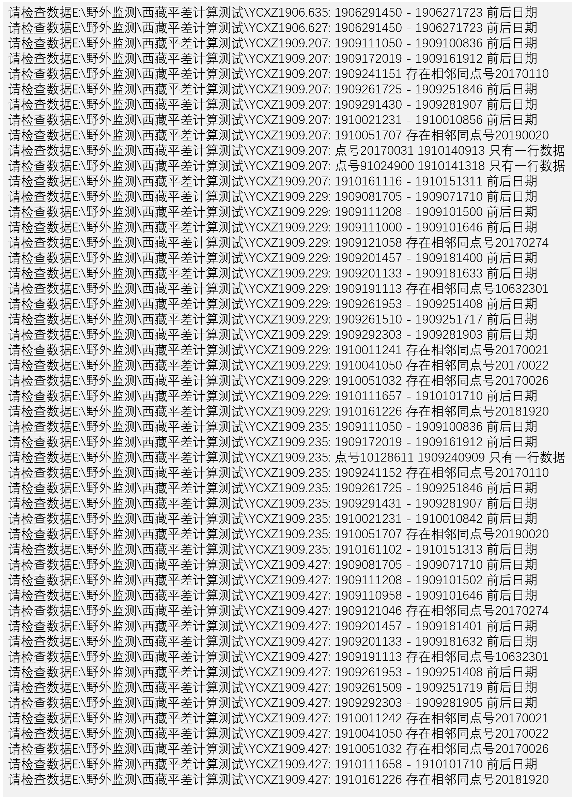
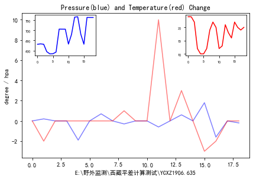
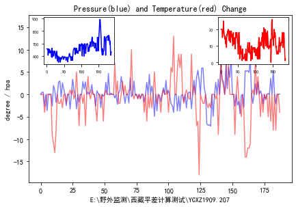
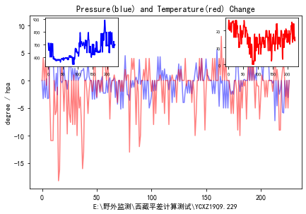

# readYnkDataCheckAndPLot

Created on Wed Feb 26 20:06:55 2020
@author: Chen Zhaohui

Python 3.7

------

Based on the LGADJ adjustment file, convert the boot file of the [Python Bayesian adjustment program](https://github.com/igp-gravity/geoist), check and plot all possible errors currently in the observation data.

## 功能

- 基于LGADJ平差文件，转换[python贝叶斯平差程序](https://github.com/igp-gravity/geoist)的引导文件，包含一些可能需要的备注，
  此外还可实现对观测数据文件的检查和绘图等。

### 数据文件检查

- 检查数据的气压值低于常理的情况；

- 检查观测时间超过24小时、分钟超过60、观测时间跨天无断开以及观测时间排序错误问题；

- 检查观测日期排序（相同天没有放在一起）问题；

- 检查相同点号之间没有用55555、44444 或 66666 隔开问题；

- 检查55555、44444 或 66666之间仅有一行数据问题；

- 检查绝对点是否在当期数据中实际联测；

- 检查点值信息文件是否包含高程列；

- 每个测点气压和温度值的相对变化结果图；

- 所有测点气压和温度值的变化曲线，可辅助气压值的检查；

- 生成贝叶斯平差所需的绝对值引导文件。

## 结果

### 检查结果

### 测点气压和温度变化结果

 
<i>如果您对该项目有任何问题，请报告issue，我将会尽快回复。</i>

<i>如果该项目对您有帮助，请为其加星支持哈，非常感谢。^_^</i>
